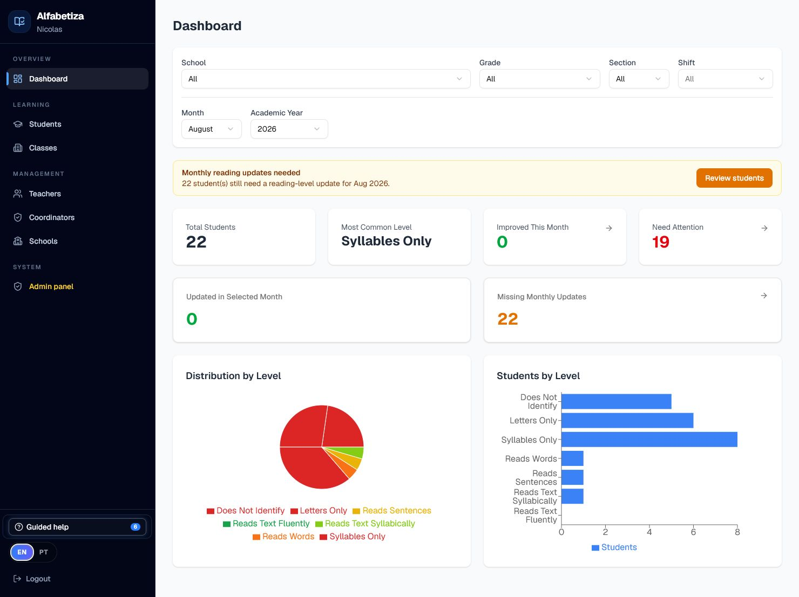
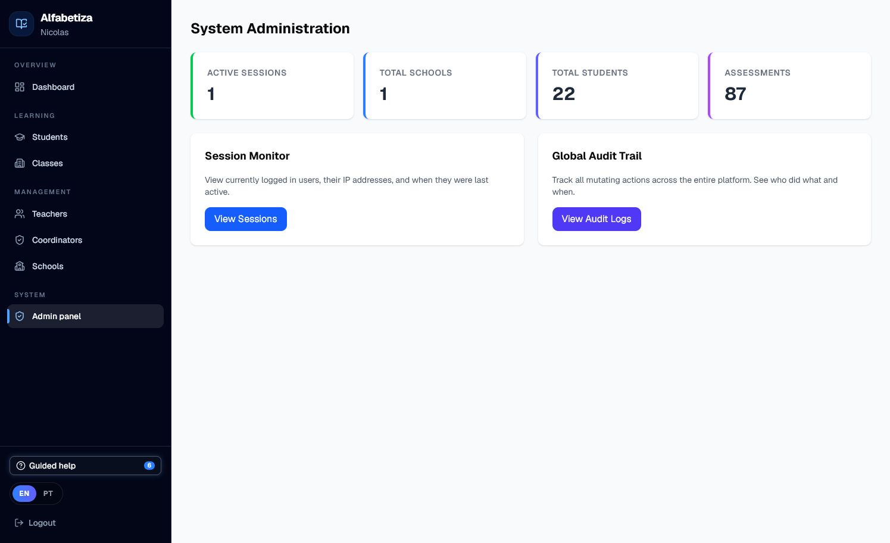

<div align="center">

# Alfabetiza

**Uma plataforma full-stack para acompanhar o desenvolvimento da leitura e identificar alunos que precisam de apoio.**

[](https://nextjs.org/)
[](https://www.typescriptlang.org/)
[](https://www.postgresql.org/)
[](https://playwright.dev/)
[](https://forthebadge.com/)

[](https://alfabetiza-app.vercel.app/)
[](docs/README.md)

[English](README.md) · [Português do Brasil](README.pt-BR.md)

</div>

## Sobre o Projeto

O Alfabetiza é um produto independente criado para resolver um problema real relatado por uma professora: manter organizados os níveis de leitura dos alunos e compreender como a alfabetização evolui ao longo do tempo.

A aplicação substitui registros manuais fragmentados por um fluxo centralizado para escolas, turmas, alunos, avaliações mensais, histórico de leitura e ações de acompanhamento. O produto está em sua fase inicial de validação, com uma primeira usuária, e está sendo projetado para receber módulos mais abrangentes de gestão acadêmica no futuro.

O projeto é planejado e desenvolvido de forma independente por [Nicolas Samuel](https://github.com/nicolsam).

## Sumário

- [Capturas de Tela](#capturas-de-tela)
- [Funcionalidades](#funcionalidades)
- [Destaques de Engenharia](#destaques-de-engenharia)
- [Arquitetura](#arquitetura)
- [Tecnologias Utilizadas](#tecnologias-utilizadas)
- [Modelo de Domínio](#modelo-de-domínio)
- [Estrutura de Pastas](#estrutura-de-pastas)
- [Como Executar](#como-executar)
- [Testes](#testes)
- [Documentação](#documentação)
- [Próximos Passos](#próximos-passos)
- [Autor](#autor)

## Capturas de Tela

### Painel de evolução da leitura



O painel resume a distribuição dos níveis de leitura, as atualizações mensais e os alunos que podem precisar de atenção. Os filtros permitem analisar os dados por escola, ano/série, turma, turno, mês e ano letivo.

### Administração e rastreabilidade



As ferramentas administrativas oferecem monitoramento de sessões, registros globais de auditoria e indicadores gerais de utilização. As imagens exibem apenas informações agregadas e não identificáveis.

## Funcionalidades

- **Acompanhamento mensal da leitura** — Mantém a evolução dos níveis em vez de armazenar somente a avaliação mais recente.
- **Painéis de progresso** — Apresentam distribuições, melhorias, atualizações pendentes e alunos que precisam de atenção.
- **Controle de acesso por escola** — Suporta professores, coordenadores acadêmicos e administradores com permissões específicas.
- **Gestão de alunos e matrículas** — Organiza escolas, turmas, alunos, contatos e histórico de matrículas.
- **Importação de alunos em lote** — Valida os dados, reutiliza registros existentes e executa as gravações de forma transacional.
- **Relatórios para responsáveis** — Gera links temporários que podem ser compartilhados sem expor o restante da plataforma.
- **Internacionalização** — Disponibiliza interfaces completas em português e inglês com `next-intl`.
- **Ajuda guiada** — Apresenta os principais fluxos do produto para novos usuários.
- **Auditoria e sessões** — Registra ações de alteração e permite acompanhar sessões ativas.
- **Busca e paginação no servidor** — Mantém as telas de gestão responsivas à medida que a base cresce.

## Destaques de Engenharia

- Modelo relacional com escolas, usuários, papéis por escola, turmas, alunos, matrículas, tipos de avaliação, níveis de leitura e avaliações mensais.
- Autorização baseada em papéis aplicada às operações protegidas da aplicação e da API.
- Restrições únicas, índices, exclusão lógica e relacionamentos em cascata definidos com Prisma.
- Importação transacional para evitar gravações parciais e reduzir consultas repetidas ao banco.
- Testes unitários e de componentes com Vitest e Testing Library.
- Testes ponta a ponta em diferentes navegadores com Playwright.
- Manual bilíngue para arquitetura, banco de dados, autenticação, APIs, testes e operações.

## Arquitetura

```text
Navegador
  └── Next.js App Router
      ├── Interface em React
      ├── Route handlers e operações no servidor
      ├── Serviços de autenticação, autorização e auditoria
      └── Prisma ORM
          └── PostgreSQL
```

## Tecnologias Utilizadas

| Área | Tecnologias |
| --- | --- |
| Frontend | Next.js 16, React 19, TypeScript, Tailwind CSS, shadcn/ui, Recharts |
| Backend | Route handlers do Next.js, Prisma ORM, Zod |
| Banco de dados | PostgreSQL, Supabase, migrations do Prisma |
| Autenticação | JWT, hash de senhas, sessões revogáveis e controle de acesso por papéis |
| Internacionalização | next-intl, inglês e português brasileiro |
| Testes | Vitest, Testing Library, Playwright |
| Experiência do produto | TipTap, Driver.js, Sonner |

## Modelo de Domínio

Os principais relacionamentos são organizados ao redor do contexto escolar:

```text
Escola
  ├── UsuárioEscola ── Usuário
  ├── Turma
  │   └── Matrícula ── Aluno
  └── AvaliaçãoMensal
      ├── TipoDeAvaliação
      └── NívelDeLeitura
```

Essa estrutura permite que um usuário tenha papéis diferentes em escolas diferentes, preservando o histórico de matrículas e avaliações dos alunos.

## Estrutura de Pastas

```text
Alfabetiza/
├── docs/                 # Manual bilíngue e imagens do projeto
├── prisma/               # Schema, migrations e dados iniciais
├── public/               # Arquivos estáticos
├── src/
│   ├── app/              # Páginas, rotas da API e layouts do App Router
│   ├── components/       # Componentes reutilizáveis da interface
│   ├── i18n/             # Configuração da internacionalização
│   ├── lib/              # Autenticação, banco, auditoria e serviços
│   └── messages/         # Traduções em inglês e português
├── tests/                # Testes ponta a ponta com Playwright
├── docker-compose.yml    # Serviço PostgreSQL local
└── package.json          # Scripts e dependências
```

## Como Executar

### Pré-requisitos

- Node.js compatível com Next.js 16
- pnpm
- Docker e Docker Compose

### Configuração

```bash
git clone https://github.com/nicolsam/Alfabetiza.git
cd Alfabetiza
pnpm install
cp .env.example .env
docker compose up -d
pnpm prisma migrate deploy
pnpm prisma db seed
pnpm dev
```

Acesse `http://localhost:3000`.

Para conhecer as variáveis de ambiente, convenções do projeto e detalhes operacionais, consulte o guia de [Primeiros Passos](docs/pt-BR/01-primeiros-passos.md).

## Testes

```bash
# Testes unitários e de componentes
pnpm test

# Cobertura
pnpm run test:coverage

# Testes ponta a ponta
pnpm run test:e2e
```

## Documentação

O manual completo para desenvolvedores é mantido nos dois idiomas:

- [English documentation](docs/README.md#english)
- [Documentação em português](docs/README.md#português-do-brasil)

O conteúdo aborda arquitetura, banco de dados, autenticação e sessões, comportamento da API, convenções de frontend, internacionalização, testes, fluxo de desenvolvimento, deploy e solução de problemas.

## Próximos Passos

O Alfabetiza é um produto independente em estágio inicial, atualmente validando seu fluxo principal de acompanhamento da leitura. Entre as possíveis evoluções estão:

- módulos mais abrangentes de gestão acadêmica e escolar;
- relatórios históricos e comparativos mais completos;
- melhoria da comunicação com pais e responsáveis;
- novos fluxos de importação e exportação;
- monitoramento operacional e automação de deploy mais robustos.

## Autor

Desenvolvido por **Nicolas Samuel**.

[GitHub](https://github.com/nicolsam) · [LinkedIn](https://www.linkedin.com/in/nicolas-samuel-veras/) · [Email](mailto:contato@nicolsam.com.br)
